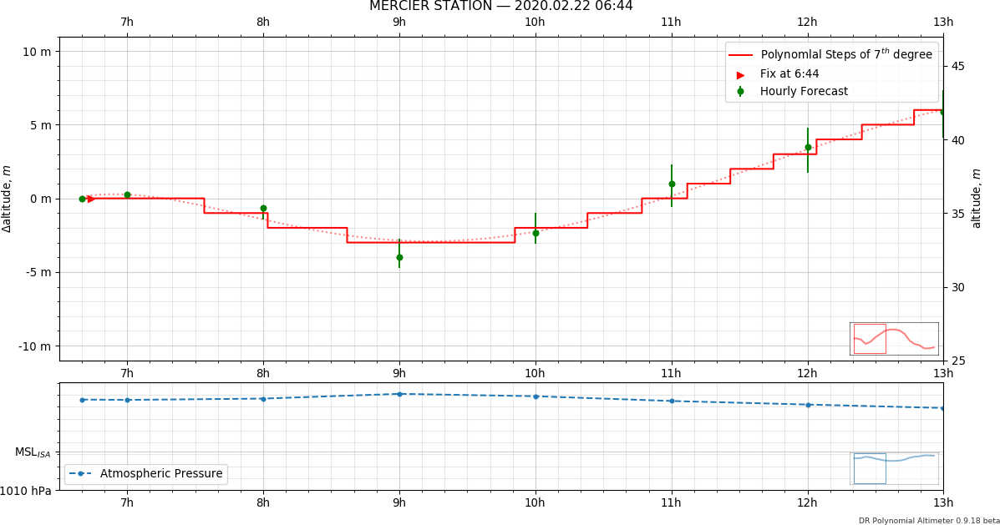
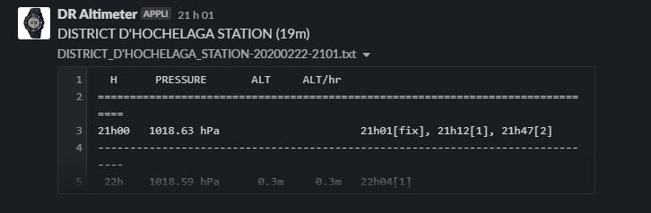

# DR-Altimeter
Altitude 'Dead Reckoning' for Casio Triple Sensor v.3

_DR-Altimeter_ predicts how much the indicated altitude will deviate due to changing weather in the vicinity of a [Wunderground.com](http://wunderground.com) station. By substracting the predicted altitude change, to remove its influence, one can greatly improve the accuracy of the _Casio Pro Trek_ wristwatch altimeter. Depending on the accuracy of the weather forecast, the indicated altitude can follow true altitude well within a ± 5 error margin.

##### Graphical output:


##### Textual output:
```
  H      PRESSURE       ALT     ALT/hr                                         
===============================================================================
21h00   1018.63 hPa                      21h01[fix], 21h12[1], 21h47[2]        
-------------------------------------------------------------------------------
 22h    1018.59 hPa      0.3m     0.3m   22h04[1]                              
-------------------------------------------------------------------------------
 23h    1018.39 hPa      2.0m     1.7m                                         
-------------------------------------------------------------------------------
 0h     1018.39 hPa      2.0m     0.0m   00h02[2], 00h44[3]                    
-------------------------------------------------------------------------------
 1h     1018.29 hPa      2.8m     0.8m   01h16[4], 01h49[5]                    
-------------------------------------------------------------------------------
 2h     1018.09 hPa      4.5m     1.7m   02h28[6]                              
-------------------------------------------------------------------------------
 3h     1017.98 hPa      5.4m     0.9m                                         
-------------------------------------------------------------------------------
 4h     1017.90 hPa      6.1m     0.7m   04h48[5]                              
-------------------------------------------------------------------------------
 5h     1017.98 hPa      5.4m    -0.7m   05h31[4]                              
-------------------------------------------------------------------------------
 6h     1018.09 hPa      4.5m    -0.9m   06h09[3], 06h49[2]                    
-------------------------------------------------------------------------------
 7h     1018.23 hPa      3.3m    -1.2m                                         
-------------------------------------------------------------------------------
 8h     1018.51 hPa      1.0m    -2.3m                                         
-------------------------------------------------------------------------------
 9h     1018.53 hPa      0.8m    -0.2m   09h24[3], 09h55[4]                    
-------------------------------------------------------------------------------
 10h    1018.21 hPa      3.5m     2.7m   10h19[5], 10h40[6], 10h59[7]          
-------------------------------------------------------------------------------
 11h    1017.81 hPa      6.8m     3.3m   11h17[8], 11h34[9], 11h51[10]         
-------------------------------------------------------------------------------
 12h    1017.38 hPa     10.4m     3.6m   12h07[11], 12h24[12], 12h40[13],      
                                         12h57[14]                             
-------------------------------------------------------------------------------
 13h    1017.00 hPa     13.5m     3.2m   13h15[15], 13h34[16], 13h55[17]       
-------------------------------------------------------------------------------
 14h    1016.58 hPa     17.0m     3.5m   14h20[18], 14h50[19]                  
-------------------------------------------------------------------------------
 15h    1016.28 hPa     19.5m     2.5m   15h38[20]                             
-------------------------------------------------------------------------------
 16h    1016.28 hPa     19.5m     0.0m                                         
-------------------------------------------------------------------------------
 17h    1016.31 hPa     19.3m    -0.2m   17h29[19]                             
-------------------------------------------------------------------------------
 18h    1016.40 hPa     18.5m    -0.7m                                         
-------------------------------------------------------------------------------
 19h    1016.31 hPa     19.3m     0.7m   19h32[20]                             
-------------------------------------------------------------------------------
 20h    1016.08 hPa     21.2m     1.9m   20h13[21], 20h38[22], 20h58[23]       
-------------------------------------------------------------------------------
 21h    1015.91 hPa     22.6m     1.4m   21h16[24], 21h32[25], 21h46[26]       
-------------------------------------------------------------------------------
 22h    1015.51 hPa     25.9m     3.3m   22h01[27], 22h14[28], 22h28[29],      
                                         22h43[30], 22h58[31]                  
-------------------------------------------------------------------------------
 23h    1014.91 hPa     30.9m     5.0m   23h15[32], 23h38[33]                  
````

## Config.ini

To regenerate the configuration file, delete config.ini. A new one will be recreated with default values.

```
[USER SETTINGS]
https page = https://blank.org
override url = 
geolocation always on = 0
autosave dpi = 300
autosave orientation = landscape
autosave papertype = letter
autosave png-pdf-eps filename = graph.png
press any key = 1
short timeout = 5
long timeout = 10
verbose = 0
minimum hours = 8
display x hours = 6
latitude =
longitude = 

```

**bold** = required, cannot be left empty or missing

#### Timeouts
| Keyword | Note |
| --- | --- |
| **short timeout** | About 5 seconds |
| **long timeout** | Between 10 and 60 seconds |

#### Automatic Save
| Keyword | Note |
| --- | --- |
| **autosave png-pdf-eps filename** | The extension determines whether a PDF, an EPS, or an PNG image file is automatically saved |
| **autosave dpi** | dot per inch |
| **autosave orientation** | _portrait_ or _landscape_  |
| **autosave papertype** | _letter_ or _legal_  |
| press any key | 0 = no, 1 = yes, default = 0 |

#### Interactive Pan/Zoom
| Keyword | Note |
| --- | --- |
**minimum hours**| Fetch at least x hours of forecast
**display x hours** | How many of the fetched hours will be displayed 

#### Geolocation
| Keyword | Note |
| --- | --- |
latitude | North = dd.ddddd, South = -dd.dddd
longitude | East = dd.ddddd, West = -dd.dddd
override url | URL of a specific weather station's hourly forecast page. Always starts with [https://www.wunderground.com/hourly/...](https://www.wunderground.com/hourly/ca/orford/IQUEBECO4)
geolocation always on |  0 = no, 1 = yes, default = 0
**https page** | URL of a random webpage, used to activate Chrome's geolocator

## Command line options

***Command lines options take precedence over *config.ini* settings***

### -n, --no-key 

**Disables "*Press any key*" pauses.** 

Useful to automate execution without user intervention

### --latitude, --longitude

Somewhere in New York City : `--latitude 40.730610 --longitude -73.935242`

### --override-url

URL of a specific weather station's hourly forecast page. Always starts with 'https://www.wunderground.com/hourly/...

Ocean Hill, Brooklin Station : `--override-url https://www.wunderground.com/hourly/us/ny/new-york%20city/KNYNEWYO736
`
### -s, --slack

If set, the textual output will be posted to your private [Slack](https://slack.com/) chat room.

By chat room _CTxxxxxxx_ id : `--slack CTU2MKQ5P`

By room _#hashtag_ : `--slack #random`

A **Bot User OAuth Access Token** must be register with the postman and included among the OS system environment variables as SLACK_API_TOKEN. The session needs to be restart (or the computer rebooted) for the environment variable to take effect. See [Create a Slack app and authenticate with Postman](https://api.slack.com/tutorials/slack-apps-and-postman) for more information and a tutorial.

 
 
### -v, --verbose

## Chromedriver.exe

The latest driver can be obtained from [Google's repository](https://chromedriver.storage.googleapis.com/index.html). Choose one that matches your current Chrome browser version to maximise compatibility.

## Known Issues

- **[Top right y axis (altitude) : scale not formatted](https://github.com/Wlodarski/DR-Altimeter/issues/1)**  
  - A [temporary solution](https://github.com/matplotlib/matplotlib/issues/15621#issuecomment-571744504) is to manually edit axis.py, line 760. 
  - The definitive one is to wait for a Matplotlib update (schedulled for 0.3.30), `pip install --upgrade matplotlib`
