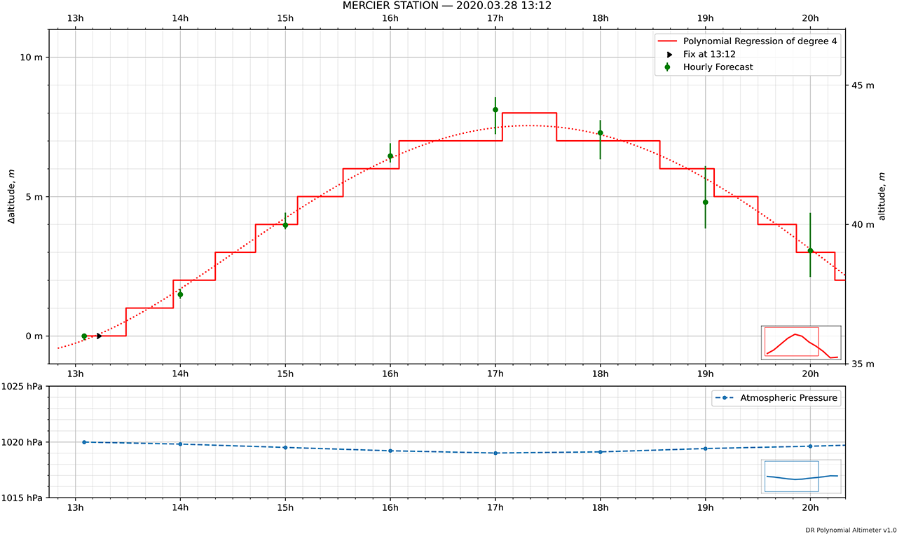

# DR-Altimeter


**Altitude '[Dead Reckoning](https://en.wikipedia.org/wiki/Dead_reckoning)' for Casio Triple Sensor v.3**

_DR-Altimeter_ predicts how much the indicated altitude will deviate due to changing weather in the vicinity of a [Wunderground.com](http://wunderground.com) station. By subtracting the predicted altitude change, to remove its influence, one can greatly improve the accuracy of the _Casio Pro Trek_ wristwatch altimeter. Depending on the accuracy of the weather forecast, the indicated altitude can follow true altitude well within a ± 5 meters error margin.

#### Some features

- Fully configurable with an .ini file
- Predictions both produced in graphical and text format
- Adaptive multilingual interface. English [en] and _français_ [fr], so far
- Text results can be automatically posted to a [Slack](https://slack.com) chat room, therefore to a smartphone
- Command line options, useful notably to create shortcuts and scheduled tasks (Windows equivalent of a cron job)
- Graphical User Interface (GUI) with zoom and pan functions, to export portions of the graph that interests you specifically


##### Figure 1: Graphical output


#### Measuring altitudes based on changes in atmospheric pressure
The altimeter determines the altitude at your current location based on accumulated atmospheric pressure changes measured by the pressure sensor. Setting the altimeter at a location where you know the precise altitude before starting your ascent enables it to take even more precise altitude measurements.

#### Sea level measurement
Setting the altimeter at a location where you know the precise altitude enables you to determine the elevation of your current position with respect to sea level. If you come across a marker indicating 400 meters above sea level while hiking or climbing, for example, simply set the altimeter at 400 meters. This enables you to obtain more accurate readings with respect to sea.

#### Vertical Dead Reckoning
[_Dead Reckoning_](https://en.wikipedia.org/wiki/Dead_reckoning) is the process of calculating one's current position by using a previously determined position, or fix, and advancing that position based upon known or estimated speeds over elapsed time and course. 

_Altitude dead reckoning_ uses the same principle as dead reckoning but applies it to the vertical plane. Whilst standing still at a fixed altitude, you'll notice that the altimeter perceives atmospheric pressure variations due to weather changes as altitude changes _as if you climbed or descended_. DR Altimeter displays in brackets [] the expected contribution of weather changes to the indicated altitude.

## Example of use

##### Figure 2: Text output
```
  H      PRESSURE       ALT     ALT/hr                                         
===============================================================================
13h05   1019.98 hPa                      13h12[fix], 13h29[1], 13h56[2]        
-------------------------------------------------------------------------------
 14h    1019.80 hPa      1.5m     1.5m   14h20[3], 14h43[4]                    
-------------------------------------------------------------------------------
 15h    1019.50 hPa      4.0m     2.5m   15h07[5], 15h33[6]                    
-------------------------------------------------------------------------------
 16h    1019.20 hPa      6.5m     2.5m   16h05[7]                              
-------------------------------------------------------------------------------
 17h    1019.00 hPa      8.1m     1.7m   17h04[8], 17h35[7]                    
-------------------------------------------------------------------------------
 18h    1019.10 hPa      7.3m    -0.8m   18h34[6]                              
-------------------------------------------------------------------------------
 19h    1019.40 hPa      4.8m    -2.5m   19h05[5], 19h30[4], 19h52[3]          
-------------------------------------------------------------------------------
 20h    1019.61 hPa      3.1m    -1.7m   20h14[2], 20h35[1], 20h57[0]          
-------------------------------------------------------------------------------
 21h    1019.87 hPa      0.9m    -2.2m   21h21[-1], 21h52[-2]                  
-------------------------------------------------------------------------------
 22h    1020.20 hPa     -1.8m    -2.7m                                                                           
````

##### Simple Example
At 13h12, you determine that you are at a known altitude of 450 meters above mean sea level. This is your reference or initial [fix].

      13h12[fix] = 450m ASL 

Later, at 13h56, your watch indicates an altitude of 476 meters. And since, between 13h12 and 13h56, the expected contribution of weather is 2 meters (see [Figure 2](README.md#figure-2-textual-output)), you can estimate your true altitude to be 476 - 2 = 474 meters above sea level.

      13h56[I] = 476m, indicated
      13h56[DR] = 476m - 13h12[2] = 474m ASL, compensated for forecasted weather
      
##### More Advanced Example
On the same trek ([see above](DR-Altimeter#simple-use)), at 19h52, you reach a point of known altitude (523m ASL). You recalibrate your watch to match this known altitude. Here and on after, this new [fix] becomes your new reference.

      19h52[fix @ 3] = 523m ASL
     
Later that evening, at 20h22, your watch indicates an altitude of 478 meters. Since your last fix was taken at the [3] compensation level (19h52[3]) and you are current at the [2] compensation level (20h22 ≈ 20h14[2]), your deduced altitude is 478 + @[3] - [2] = 479 meters.

      20h22[I] = 478m, indicated
      20h22[DR] = (478m + @ 19h52[3]) - 20h14[2]
                = 481 - 2
                = 479m ASL, compensated for forecasted weather 
               
## Installation

See [INSTALL.md](INSTALL.md)

##  Configuration

See [CONFIG.md](CONFIG.md)

## Command Line Options

See [COMMAND.md](COMMAND.md)

## Author
- **Walter Wlodarski** - *Creator* - [Wlodarski](https://github.com/Wlodarski)

## License

This project is licensed under the MIT License - see the [LICENSE.md](LICENSE.md) file for details
